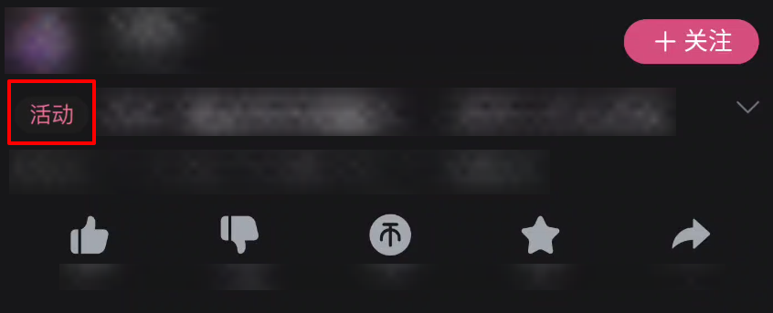
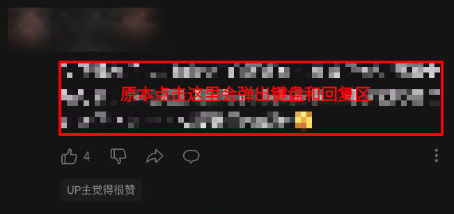
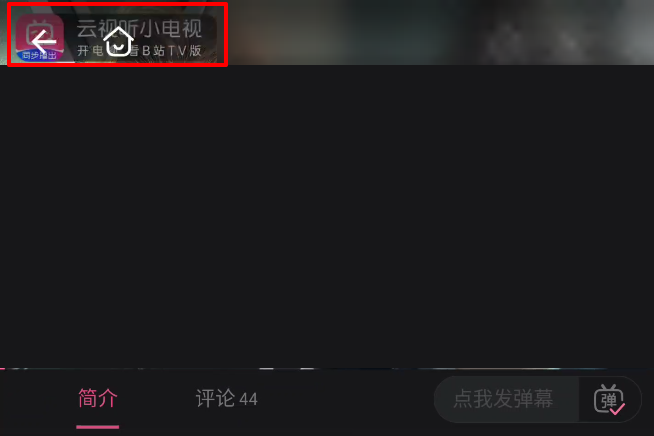

# Make Bilibili Great Again!

## 功能

目前只支持国际版(com.bilibili.app.in)，兼容性见文末

### 首页

* [X] 干掉竖屏

### 搜索页

* [X] 干掉热搜，简单修改代码也可干掉建议搜索，等设置界面做出来以后这里可以自由配置

### 视频播放页

* [X] 干掉播放器内展示的关注弹窗、投票弹窗等（包括UP主弹幕）
* [X] 视频标题左边的“热门”等标签
  
* [X] 点击评论区文字不会自动弹出回复区
  
* [X] 干掉播放器内展示的“云视听小电视”等activityMeta（不确定未来这个字段里还会塞些什么乱七八糟的东西，目前要么没有要么就是这个云视听，直接全部干掉了）
  

### 设置

* [ ] 在B站设置界面的标题上加上一个MBGA的按钮，点击打开MBGA的设置
* [ ] 配置项
  * [ ] 是否要干掉UP主弹幕
  * [ ] 搜索页要干掉哪些区块（热搜、历史搜索、建议搜索）

## 感谢

> 本项目参考、使用了下列开源项目的部分或全部内容

* [Yuki Hook API](https://github.com/HighCapable/YukiHookAPI)
* [FuckBilibiliVote](https://github.com/zerorooot/FuckBilibiliVote)
* [不要竖屏](https://github.com/WankkoRee/Portrait2Landscape)

## 兼容性

下面仅列出测试过的版本，相近版本大概率能兼容

* MBGA v1.0.0
  * 兼容国际版3.18.2
