# Make Bilibili Great Again!

## 功能

目前只支持国际版(com.bilibili.app.in)，兼容性见文末

### 设置

* 打开B站->我的->设置->标题上有MBGA字样，点击打开设置界面

### 底部Tab

* 允许干掉除了“我的”以外的所有Tab

### 首页

* 干掉竖屏
* 禁止切后台一段时间回来后自动刷新视频列表
* 防止刷新推荐视频时之前的列表被自动清除  
  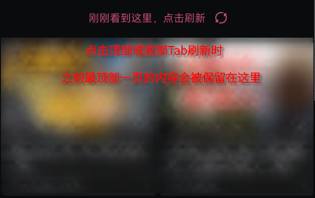
* 支持过滤非UGC，只展示用户上传的视频
* 支持过滤过短的视频

### 搜索页

* 干掉热搜
* 干掉搜索历史
* 干掉搜索发现
* 禁止在搜索框内推荐搜索词  
  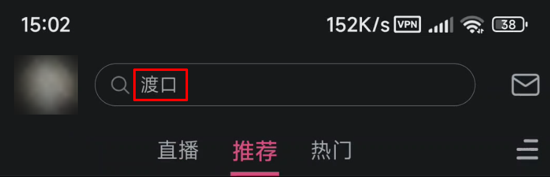

### 视频播放器

* 干掉播放器内展示的“云视听小电视”等activityMeta（不确定未来这个字段里还会塞些什么乱七八糟的东西，目前要么没有要么就是这个云视听，直接全部干掉了）  
  
* 干掉播放器内展示的关注弹窗、投票弹窗等（包括UP主弹幕）
* 禁止播放器自动开启章节进度条  
  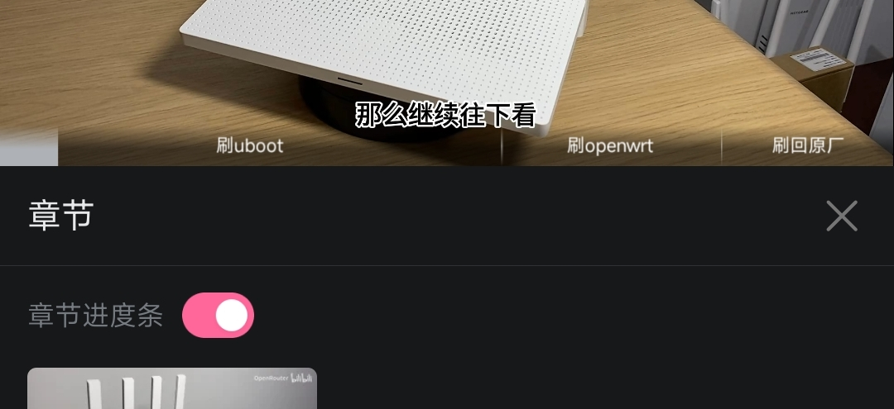
* 允许在小窗、分屏模式下全屏播放（体验并不是非常好）
* 禁止展示竖屏全屏按钮  
  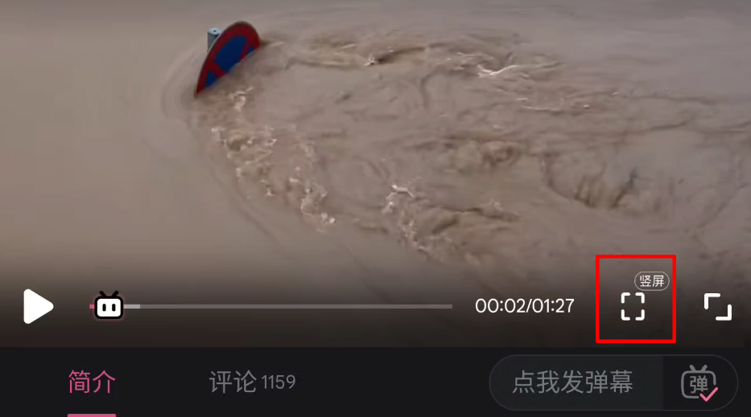
* 禁止点击弹幕  
  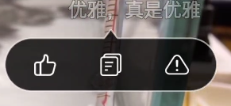
* 禁止展示反馈弹窗  
  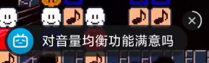
* 全屏时禁止展示在线人数  
  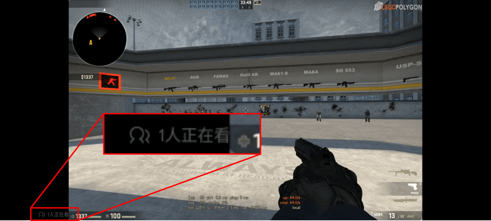

### 视频详情页

* 视频标题左边的“热门”等标签  
  
* 更纯粹的链接分享  
  原来分享链接是`https://b23.tv/xxxxxxx`这样的短链，展开后有乱七八糟的参数，让它变成`https://b23.tv/av10492`这样干净的av号链接
* 干掉下方相关视频

### 视频评论区

* 完全隐藏评论区
* 点击评论区文字不会自动弹出回复区  
  
* 干掉评论区投票  
  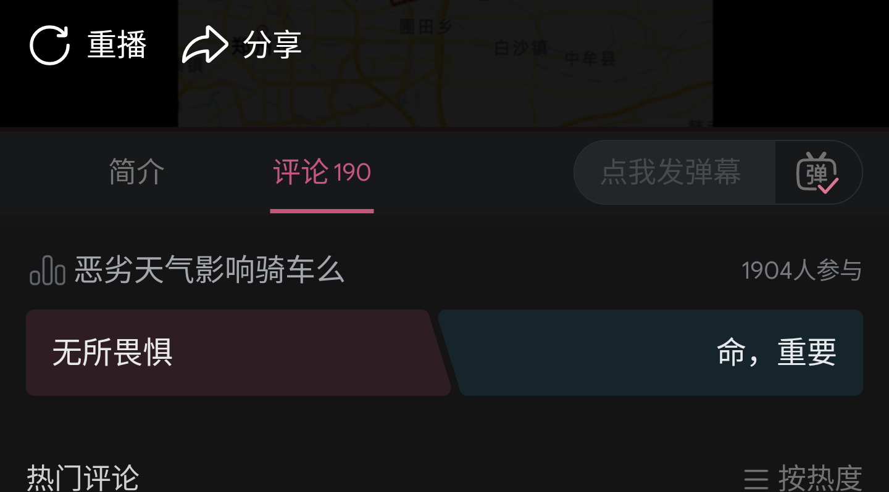
* 干掉评论区的关注按钮（笔记类型的评论右上角）  
  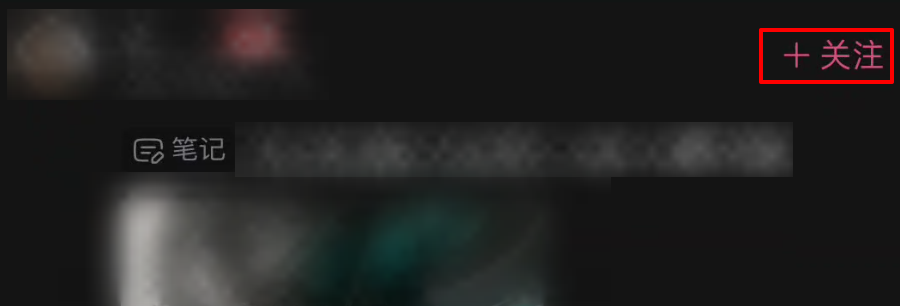
* 干掉评论内的关键词高亮搜索  
  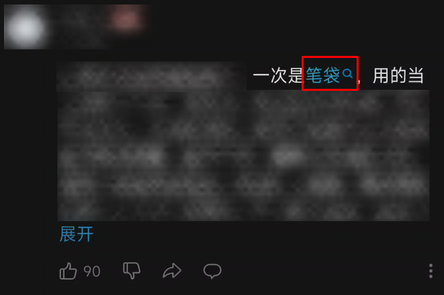
* 没有评论时禁止一键发送评论  
  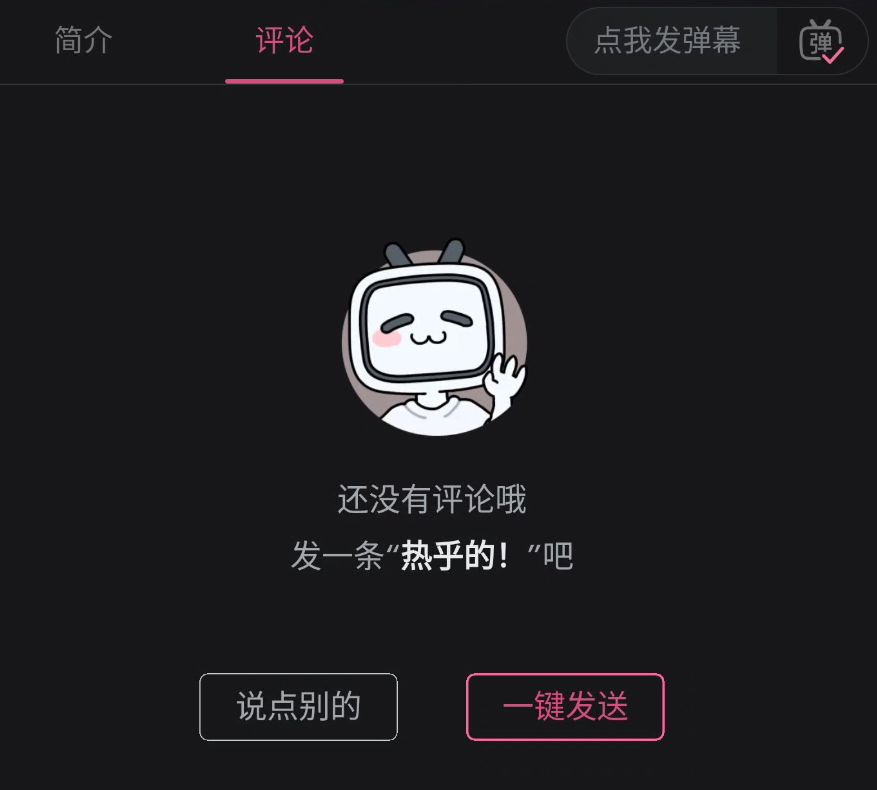
* 禁止展示反馈问卷  
  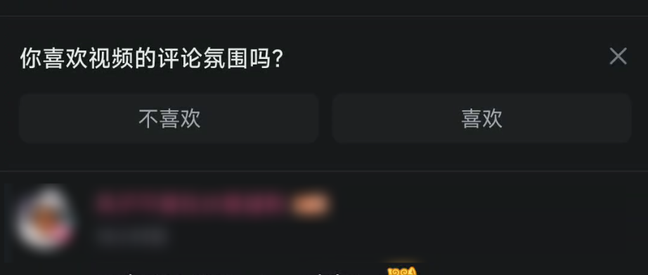
* 禁止展示评论区顶部推广内容  
  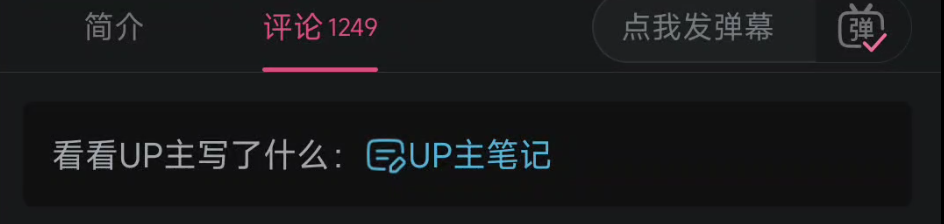

### 我的

* 在“更多服务”部分添加搜索入口，配合隐藏“首页”tab食用  
  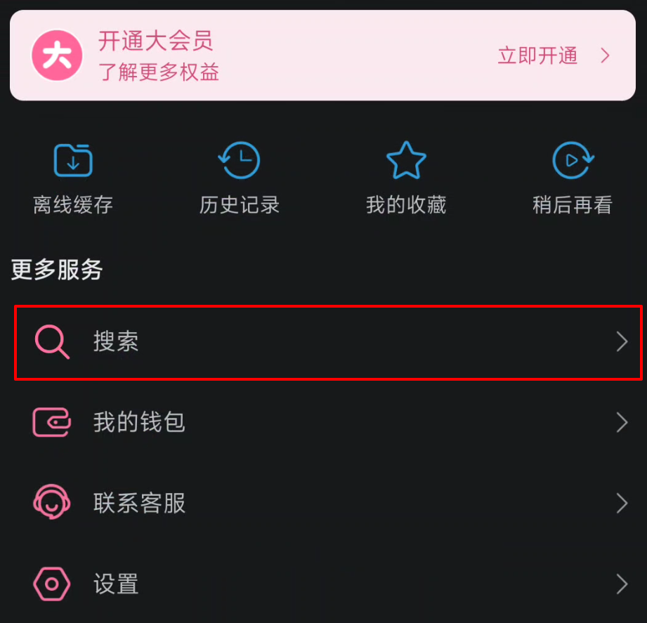

## 感谢

> 本项目参考、使用了下列开源项目的部分或全部内容

* [Yuki Hook API](https://github.com/HighCapable/YukiHookAPI)
* [FuckBilibiliVote](https://github.com/zerorooot/FuckBilibiliVote)
* [不要竖屏](https://github.com/WankkoRee/Portrait2Landscape)

## 兼容性

下面仅列出测试过的版本，相近版本大概率能兼容

* MBGA v1.0.0 ~ v1.0.6
  * 兼容国际版 未知 ~ 3.18.2
* MBGA v1.1.0 ~
  * 兼容国际版 未知 ~ 3.18.2 ~ 3.19.2
* MBGA v1.2.0 ~
  * 兼容国际版 未知 ~ 3.18.2 ~ 3.19.2
* MBGA v1.3.0 ~
  * 兼容国际版 未知 ~ 3.19.0 ~ 3.19.2
